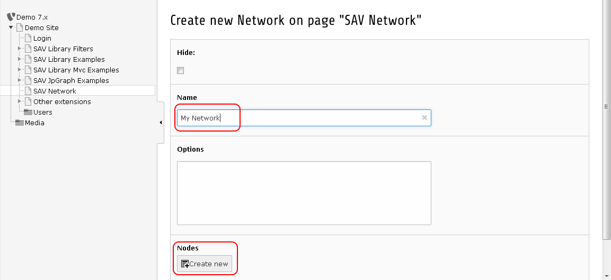
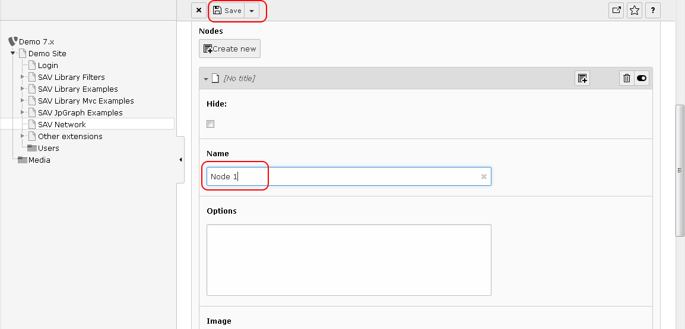
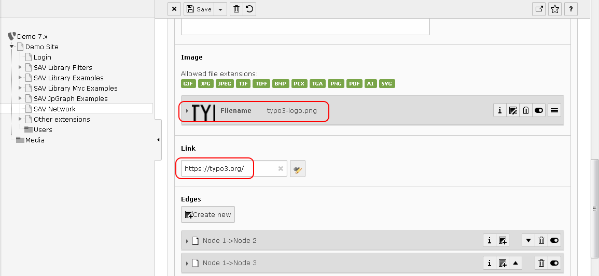
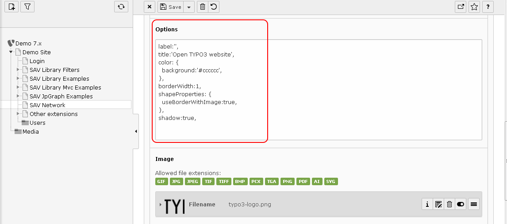

.. include:: ../Includes.txt

.. _UsersManual:

============
Users Manual
============

Creating a New Network
======================

Download the extension and install it.

Create a page and add a new Network record.

Fill the network name and add a node by clicking on the "Create new" button.

Fill the node name and save.

Now insert a plugin in your page, select SAV Network, and select your network.

Go to your page in the frontend and you should see your network which has only one node.

Go back to the backend, click on your network record and add new nodes with the "Create new" button as explained above.
The following figure shows the network record once two new nodes were added.

Now in the frontend you should see your three nodes.

Once you have at least created two nodes, you can add edges between nodes.
Let us assume that we want to connect "Node 1" to "Node 2" and to "Node 3".

Go back to the backend, click on your network record and expand the first node.

Add a new edge by clicking on the "Create new" button.

Fill the "From" and "To" Nodes then save.

Do the same for the edge between "Node 1" and "Node 3" and go to the frontend.

Click on a node and move the mouse to enjoy the effect of vis.js library.

Adding Images or Links to Nodes
===============================

Adding an image or a link to one node can be easily done using the wizards.

In the following figure the TYPO3 logo and a link to TYPO3 website are associated with "Node 1".

Going to the frontend will now display the network where "Node 1" is the TYPO3 logo. TYPO3 website is accessed by clicking on the TYPO3 logo.

Adding Options
==============

As you may have noticed, there is an "Options field" in networks, nodes and edges.
Options are described in the `vis.js documentation for networks <http://visjs.org/docs/network/>`_. They make it possible
to change the configuration of your network.

For example, assume that we want to:

- remove the label under the TYPO3 logo,

- have the logo in a box with a grey background and with a border and a shadow,

- display a "title" when the mouse hovers over the logo.

In the "Options field" of "Node 1" enter the configuration displayed in the following figure.

Go to the frontend to see the result.

